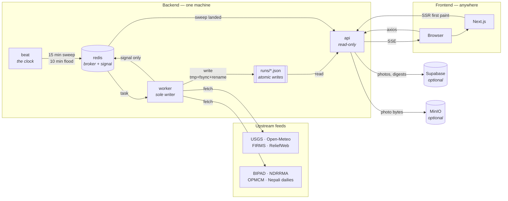

# Architecture

Atlas is a **Python/FastAPI backend** and a **Next.js frontend**. All fetching,
scraping, scheduling and persistence is Python. The frontend renders and nothing
else — it has no server-side data code and no database or storage clients.

```
backend/     FastAPI + Celery. Every source, every route, every schedule.
frontend/    Next.js. Pages, views, components. Talks to the API over axios.
infra/       dev/, prod/ and split/ Compose stacks.
docs/        This.
runs/        Gitignored. The worker writes it; the API reads it.
supabase/    The SQL schema, applied out of band.
```

| Piece | What is actually used |
|---|---|
| Backend | Python 3.12, FastAPI, Celery + Redis, `httpx`, `structlog` |
| Frontend | Node 22, Next.js 16 (App Router), React 19, Tailwind v4, shadcn/ui |
| Transport | axios (`frontend/src/config/axios.ts`) |
| Server state | TanStack Query (`frontend/src/hooks/use*.ts`) |
| Client state | Redux Toolkit (`frontend/src/store/`) — theme, language, display prefs |
| Database | Hosted Supabase over PostgREST (`supabase-py`). Optional. |
| Object store | MinIO. Optional, behind a Compose profile. |
| LLM | Raw `httpx` in `backend/app/domains/ai/providers/` — no vendor SDKs |

## The shape of it



## The three backend processes

| Service | Does | Constraint |
|---|---|---|
| `api` | Serves HTTP. **Reads** `runs/`, never writes it. | Never fetches from a government portal on the request path. |
| `worker` | Runs every sweep and refresh. The **only** writer of `runs/`. | **Do not scale past one replica.** |
| `beat` | The clock. 15-min hazard sweep, 10-min flood refresh. | Separate so restarting a worker mid-sweep does not lose the schedule. |

Redis is Celery's broker **and** the channel the worker uses to tell the API a
sweep landed. It carries the signal, never the state — the payloads are the JSON
files under `runs/`, which both services mount.

## How data reaches the page

Nothing is stored in a database. A cycle ends in a **complete rewrite** of a
file under `runs/`:

| File | Holds |
|---|---|
| `dashboard.json` | The hazard snapshot the dashboard renders |
| `latest.json` | The raw sweep output |
| `flood-desk.json` | The desk payload — gauges, portal, bulletins |
| `flood-desk-persons.json` | The lost-and-found register |
| `flood-desk-rescue.json` | The rescue register |
| `memory/` | Delta memory: `hot.json` plus `cold/YYYY-MM-DD.json` |

**Every write is atomic** (`backend/app/core/runs_store.py`): the previous file
is copied to `.bak`, the new bytes go to a `.tmp` in the same directory, are
`fsync`ed, then `os.replace`d over the target. Rename is atomic within a
filesystem, so a reader polling every few seconds sees either the previous
complete file or the next one — never a half-written one. Reads never raise; a
missing or corrupt file answers `None` and the page renders its empty state.

**Merging happens in memory, before the write.** Each source loads
independently and `apply()` runs only on success, so a source that fails leaves
its previous value standing while the others refresh. An emptied register and
an unreachable portal are different facts, and only the second should leave old
data on the page.

Then the update reaches the browser two ways:

- **Pushed** — the worker publishes a few bytes on Redis, the API re-reads the
  file and pushes the snapshot over SSE, and `useSweepStream` writes it into the
  TanStack cache. The dashboard updates without a reload.
- **Polled** — both pages also refetch every two minutes. Not redundant: a proxy
  that buffers event-streams or a dropped connection the browser never retries
  would otherwise leave the page silently frozen. The flood desk has no push
  today, so the poll is its only path.

## Directory map

| Path | Purpose |
|---|---|
| `backend/app/core/` | config, logging, errors, http, nepal, supabase, storage, celery, `runs_store` |
| `backend/app/api/v1/router.py` | Where domain routers mount |
| `backend/app/domains/hazards/` | 5 sources, synthesize, delta, sweep task |
| `backend/app/domains/flood/` | gauges, BIPAD, NDRRMA, bulletins, rescue portal, desk store, 10-min task |
| `backend/app/domains/news/` | wire, YouTube, digests, topic cache |
| `backend/app/domains/media/` | the signed image proxy |
| `backend/app/domains/photos/` | ground reports: EXIF walker, upload rails |
| `backend/app/domains/ai/` | 11 LLM providers, reads, insights, ask sandbox |
| `backend/app/domains/alerts/` | Telegram and Discord |
| `backend/app/domains/stream/` | SSE over Redis pub/sub |
| `backend/content/` | **Reviewed** funds, helplines, sitrep. Higher bar than code. |
| `backend/scripts/` | diag, sweep, flood_refresh, migrate_check, clean |
| `frontend/src/config/axios.ts` | The one HTTP client |
| `frontend/src/services/` | One thin file per domain |
| `frontend/src/hooks/use*.ts` | TanStack Query over the services |
| `frontend/src/store/` | Redux slices: theme, language, desk prefs |
| `frontend/src/types/index.ts` | **The API contract.** Backend responses must satisfy it. |

Geography is centralised in `backend/app/core/nepal.py` and
`backend/app/domains/flood/scope.py`. The frontend keeps a small read-only
subset in `frontend/src/lib/nepal-geo.ts` and `frontend/src/lib/flood-scope.ts`
because the map
needs it client-side; both say so at the top. Do not scatter bounding boxes.

## Conventions

- **Domain folders** with `sources/`, `service.py`, `routers.py`, `tasks.py`.
- **Responses are camelCase.** `frontend/src/types/index.ts` is the contract and
  `backend/tests/test_contract.py` fails the build on a snake_case key or a
  missing field. This is the likeliest way a change breaks a panel, because
  Python naming conventions push the other way.
- **Sources** answer a dict, are runnable alone
  (`python -m app.domains.hazards.sources.seismic`), and never raise: a failure
  returns an error shape so `asyncio.gather` cannot lose the other sources.
- **`safe_fetch` never raises.** Check `is_error()` before using a result.
- **No component calls `fetch` directly.** Services → hooks → views.

## Deployment topologies

**One machine** (`infra/prod`) — Traefik terminating TLS for both hostnames,
everything beside each other.

**Two machines** (`infra/split`, `make be` / `make fe`) — the frontend holds no
state, so it can live anywhere, Cloudflare included. The backend cannot be
split further: `runs/` is a host-local bind mount with one writer, so `api`,
`worker` and `beat` stay together. `ALLOWED_ORIGINS` must name the frontend's
origin or every browser call fails CORS preflight.

## Known gaps

- **The worker cannot be scaled.** It is the sole writer of `runs/`, a
  host-local bind mount. Moving that state into Postgres or Redis is the
  prerequisite for horizontal scaling, and should happen before `infra/prod`
  becomes a Swarm stack.
- **The flood desk has no push.** The hazard sweep publishes to the event bus;
  the flood refresh does not, so a landed cycle reaches the desk only on the
  next two-minute poll.
- **The news topic cache and the ask-sandbox rate limit are per process.**
  Behind more than one API replica each holds its own, which multiplies the
  sandbox's hourly ceiling.
- **`make migrate` does not migrate.** PostgREST cannot run DDL; it only checks
  the tables and the `flood_photo_recount` RPC are reachable.
- **The interactive bots are not implemented.** Alerts are one-way. A two-way
  bot needs its own long-lived process.
- **Compose is single-host by design**, not by omission.
